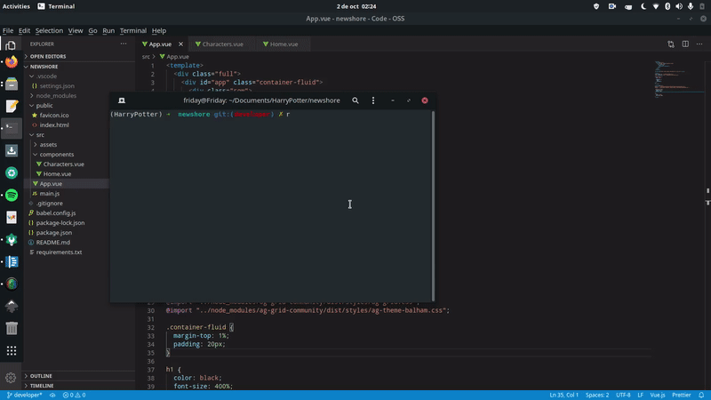

# HarryPotter

In order to run our application, we need to follow the next instructions:

1. Clone the repository from developer branch as follows:

 ```bash
  git clone --single-branch --branch developer https://github.com/satorresja/HarryPotter.git
  ```
2. Enter the folder called newshore:
  ```bash
  cd newshore 
  ```   

3. Install all needed dependencies for our application:
  ```bash
  npm install 
  ```
  followed by the line:
  ```bash
  npm run serve
  ```
 
You will see something like this:


